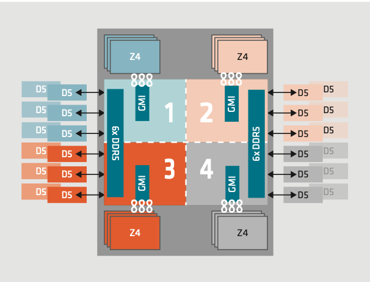

# The STREAM benchmark

The [STREAM benchmark](https://github.com/jeffhammond/STREAM) is a simple synthetic benchmark program that measures the RAM bandwidth of a computer system.
Knowing the RAM bandwidth is important because it can be a bottleneck for many applications, especially those that are memory-bound. By measuring the RAM bandwidth, we can get an idea of how well the system can handle memory-intensive workloads.

The STREAM benchmark consists of four main operations: **Copy**, **Scale**, **Add**, and **Triad**. Each of these operations performs a specific memory access pattern, and by measuring the time taken to perform these operations, we can calculate the effective memory bandwidth of the system.

## Step 0. Before we start

In this tutorial we will assess the RAM bandwidth of the **GENOA** nodes using the STREAM benchmark.
Knowing the architectural details of the system is crucial to understand the results of the benchmark and to interpret them correctly as it will be clear in the following.

### 0.1 Computing the theoretical peak performance

The theoretical peak performance of a system can be calculated using the following formula:

$$
\mathcal{B}_{\text{peak}} =
N_{\text{channels}} \cdot
f_{\text{clock}} \cdot
w_{\text{bus}}
$$

Where:

- $N_{\text{channels}}$ is the number of memory channels in the system.
- $f_{\text{clock}}$ is the clock frequency of the memory.
- $w_{\text{bus}}$ is the width of the memory bus (in bytes).

The **GENOA** nodes are equipped with 2 [AMD EPYC 9374F 32-Core](https://www.amd.com/en/products/processors/server/epyc/4th-generation-9004-and-8004-series/amd-epyc-9374f.html) processors, each of which has

- 8 memory channels: $N_{\text{channels}} = 8$
- A memory clock frequency $f_{\text{clock}} = 4800 MT/s$ 
- A memory bus width of 64 bits, which is equivalent to $w_{\text{bus}} = 8$ bytes

Since the GENOA nodes have 2 processors, we need to multiply the result by 2 to get the total theoretical peak performance of the system:

$$
\mathcal{B}_{\text{peak}} =
2 \cdot
8 \cdot
4800 \cdot
8 = 614.4 \text{ GB/s}
$$

??? abstract "More details"
    Each cpu has 4 NUMA regions, each of which has 3 memory channels where tere are 2 DIMMs (Dual In-line Memory Modules) per channel. This means that each NUMA region has 6 DIMMs, and each CPU has a total of 24 DIMMs. 

    

    If you want to know more about the architecture of the GENOA nodes, this [white paper from AMD](https://www.amd.com/content/dam/amd/en/documents/products/epyc/4th-gen-epyc-processor-architecture-white-paper.pdf?utm_source=chatgpt.com) (where the image above is taken from) is a great resource to understand the details of the architecture!


### 0.2 The `icx` compiler

??? danger "Notes about `icx` compiler"

    In the following exercitation both the `gcc` and the `icx` compilers are used. This is done to highlight how the same code can be compiled with different compilers and to show the differences in performance that can be achieved by using different compilers.

    To install the `icx` compiler, provided by the *Intel OneAPI* toolchain, you can follow the instructions in the [official documentation](https://www.intel.com/content/www/us/en/docs/oneapi/installation-guide-linux/2025-1/hpc-online-offline.html#HPC-ONLINE-OFFLINE).

    ```bash 
    mkdir -p $HOME/src/intel-oneapi
    cd $HOME/src/intel-oneapi
    wget https://registrationcenter-download.intel.com/akdlm/IRC_NAS/d0df6732-bf5c-493b-a484-6094bea53787/intel-oneapi-hpc-toolkit-2025.1.0.666_offline.sh
    sh ./intel-oneapi-hpc-toolkit-2025.1.0.666_offline.sh -a --silent --eula accept
    ```

    This will create the directory `$HOME/intel/oneapi` where the toolchain will be installed. You can then source the `setvars.sh` script to set up the environment variables for the `icx` compiler:

    ```bash
    source $HOME/intel/oneapi/setvars.sh
    ```

## Step 1. Download, compile and run the STREAM benchmark

### 1.1 Download the code

First of all, we need to download the source code of the STREAM benchmark. We can do this by cloning the GitHub repository:

```bash
git clone https://github.com/jeffhammond/STREAM.git
```

And request some resources to compile and run the benchmark. In order to fully utilize the memory bandwidth of the system, we need to exploit all the memory channels available. This means that we need to run the benchmark on all the NUMA regions of the system, i.e., asking for the whole CPUs core (64 cores in total). Since we are going to book the whole CPU, we can also ask for the whole memory of the system:

```bash
srun --partition GENOA --account lade --nodes 1 --ntasks-per-node 1  --cpus-per-task 64 --mem 500G --time 01:00:00  --pty /bin/bash
```

Then go into the `STREAM` directory and store the example Makefile in a backup file, since we are not going to use it as it is:

```bash
cd STREAM
cp Makefile Makefile.backup
```

### 1.2. First attemp: no optimization:

In this first attempt, we will compile the code without any optimization flag. The following `Makefile` is the equivalent of launcing `gcc -o stream stream.c` and `icx -o stream stream.c` for the `gcc` and `icx` compilers, respectively:

```makefile
CC = gcc
ICC = icx

.PHONY: all clean

all: stream_c.exe stream_icx.exe

stream_c.exe: stream.c
	$(CC) stream.c -o stream_gcc.exe

stream_icx.exe: stream.c
	$(ICC)  stream.c -o stream_icx.exe

clean:
	rm -f stream_gcc.exe stream_icx.exe *.o
```

And compile simply with 

```bash 
make
```

Then we can run the benchmark with the following command:

```bash
./stream_gcc.exe
```

```
-------------------------------------------------------------
Function    Best Rate MB/s  Avg time     Min time     Max time
Copy:           17803.1     0.009000     0.008987     0.009016
Scale:          15319.9     0.010469     0.010444     0.010597
Add:            25726.0     0.009370     0.009329     0.009440
Triad:          19793.8     0.012153     0.012125     0.012207
-------------------------------------------------------------
```

And 

```bash
./stream_icx.exe
```

```
-------------------------------------------------------------
Function    Best Rate MB/s  Avg time     Min time     Max time
Copy:           48975.3     0.003464     0.003267     0.003585
Scale:          36142.6     0.004494     0.004427     0.004568
Add:            39312.6     0.006345     0.006105     0.006526
Triad:          37652.6     0.006403     0.006374     0.006463
-------------------------------------------------------------
```

We are hitting a very low performance: 4.18% of the theoretical peak performance with `gcc` and 7.97% with `icx`. 
There are several reason for this, but even with this simple example we can see how the choice of the compiler can have a significant impact on the performance of the code. 


??? abstract "Why the Copy performance outperforms the other operations?"

    The Copy operation is the simplest of the four operations, in the code is implemented as:

    ```c
    #pragma omp parallel for
        for (j=0; j<STREAM_ARRAY_SIZE; j++)
            c[j] = a[j];
    ```

    This operation simply copies the contents of array `a` into array `c`, so the traffic is one memory read and one memory write. 
    
    The other operations, instead, involve more comutation which must be performed on the data, which impact the overall perforamnce. For example the Triad operation is implemented as:

    ```c
    #pragma omp parallel for
        for (j=0; j<STREAM_ARRAY_SIZE; j++)
            a[j] = b[j] + scalar*c[j];
    ```

    If you are interested, a recomended read to understand the details is [this stackoverflow answer](https://superuser.com/questions/1815148/expected-results-of-a-stream-memory-bandwidth-benchmark).

### 1.3. Reading the code and understanding the optimizations

The first thing we can do to improve the performance of the code is to read it and understand what it is doing. The code is quite simple and straightforward, but there are some details that we can pay attention to in order to understand how to optimize it

The code support a `STREAM_ARRAY_SIZE` macro that defines the size of the arrays that are used in the benchmark. By default, this macro is set to 10 million, which means that each array will be $\sim 76.3$ MB in size (since each element is a double, which is 8 bytes). This means that the total memory used by the benchmark is $\sim 0.2$ GB.
Moreover with this compilation OpenMP is not enabled, so the code is running in serial, which means that we are not exploiting the parallelism of the system.

This is definitely not enough to fully utilize the memory bandwidth of the system. 

### 1.4 Second attemp: enabling OpenMP

The STREAM benchmark is designed to be run in parallel, so we can enable OpenMP to exploit the parallelism of the system. 


For what concern the array size, it is important to choose a size that is large enough to exeed the size of the cache, but not too large to cause swapping or other overhead.
The STEAM benchmark recommends to use an array size that is at least 4 time the size of the last level cache (LLC) of the system. In the case of the GENOA nodes:

- The LLC size is 512 MB
- $\Rightarrow 4 \cdot 512 \text{ MB} = 2048 \text{ MB} 
- Using double precision, we have 8 bytes per element, $\Rightarrow \frac{2048 \text{ MB}}{8 \text{ bytes/element}} \simeq 268,435,456$

Hence, we can set the `STREAM_ARRAY_SIZE` to 280,000,000 to be sure to exeed the size of the cache (otherwise results may be not meaningful since we are not measuring the RAM bandwidth but the cache bandwidth).

Note that since we are going to allocate 3 arrays of this size for a total of $\sim 6.7$ GB of memory, the flag `-mcmodel=medium` is needed to allow the compiler to generate code that can access more than 2 GB of memory.

??? note "Example of a wrong result"

    Here it is reported an example of a wrong result obtained by using an array size that is too small (10 million) while using the entire CPU (64 cores). In this case, we are measuring the cache bandwidth instead of the RAM bandwidth, which is not what we want to do:

    ```
    -------------------------------------------------------------
    Function    Best Rate MB/s  Avg time     Min time     Max time
    Copy:         1018343.9     0.000242     0.000157     0.000725
    Scale:         812456.0     0.000210     0.000197     0.000219
    Add:          1238170.9     0.000237     0.000194     0.000471
    Triad:        1033504.1     0.000297     0.000232     0.000719
    -------------------------------------------------------------
    ```
    The peak performance is arount 1 TB/s, which is much higher than the theoretical peak performance of the system (614.4 GB/s). This is a clear indication that we are measuring the cache bandwidth instead of the RAM bandwidth.

Here is reported the `Makefile` with the optimizations to enable OpenMP and set the array size (the `NTIMES` macro is set to 100 to increase the number of iterations and get more stable results and statistical significance of the results):

```makefile
CC = gcc
ICC = icx

CCFLAGS = -fopenmp -mcmodel=medium
ICCFLAGS = -qopenmp -mcmodel=medium
STREAM_FLAGS = -DSTREAM_ARRAY_SIZE=280000000 \
               -DNTIMES=100 \
               -DSTREAM_TYPE=double

.PHONY: all clean

all: stream_c.exe stream_icx.exe

stream_c.exe: stream.c
	$(CC) $(STREAM_FLAGS) $(CCFLAGS) stream.c -o stream_gcc.exe

stream_icx.exe: stream.c
	$(ICC) $(STREAM_FLAGS) $(ICCFLAGS) stream.c -o stream_icx.exe

clean:
	rm -f stream_gcc.exe stream_icx.exe *.o
```

```bash
# remove previous executables
make clean
make
# set the environment variables for OpenMP
export OMP_NUM_THREADS=64
export OMP_PLACES=cores
export OMP_PROC_BIND=close
```

```
./stream_gcc.exe
```

```
-------------------------------------------------------------
Function    Best Rate MB/s  Avg time     Min time     Max time
Copy:          349564.3     0.013559     0.012816     0.024394
Scale:         337424.3     0.014151     0.013277     0.022689
Add:           379702.9     0.018524     0.017698     0.026914
Triad:         380266.4     0.018691     0.017672     0.030800
-------------------------------------------------------------
```

```
./stream_icx.exe
```

```
-------------------------------------------------------------
Function    Best Rate MB/s  Avg time     Min time     Max time
Copy:          499336.4     0.009450     0.008972     0.014175
Scale:         348259.3     0.013139     0.012864     0.017866
Add:           376114.8     0.018243     0.017867     0.023527
Triad:         380972.3     0.018087     0.017639     0.024045
-------------------------------------------------------------
```

We are now hitting a much higher performance: 61.8% of the theoretical peak performance with `gcc` and 81.2% with `icx`. 


### 1.5 Other optimizations

As last example of optimization, we can try to use some compiler flags to further improve the performance of the code. 

For example:

```Makefile
CC = gcc
ICC = icx

CCFLAGS = -fopenmp -mcmodel=medium -O3 -Ofast -ffast-math -march=native -ftree-vectorize -funroll-loops 
ICCFLAGS = -qopenmp -mcmodel=medium -O3 -ffast-math -march=native -qopt-streaming-stores always -ftree-vectorize -funroll-loops
STREAM_FLAGS = -DSTREAM_ARRAY_SIZE=280000000 \
               -DNTIMES=100 \
               -DSTREAM_TYPE=double

.PHONY: all clean

all: stream_c.exe stream_icx.exe

stream_c.exe: stream.c
	$(CC) $(STREAM_FLAGS) $(CCFLAGS) stream.c -o stream_gcc.exe

stream_icx.exe: stream.c
	$(ICC) $(STREAM_FLAGS) $(ICCFLAGS) stream.c -o stream_icx.exe

clean:
	rm -f stream_gcc.exe stream_icx.exe *.o
```

```bash
make clean
make
```

```bash
./stream_gcc.exe
```

```
-------------------------------------------------------------
Function    Best Rate MB/s  Avg time     Min time     Max time
Copy:          485103.4     0.009755     0.009235     0.018296
Scale:         347933.2     0.013351     0.012876     0.020753
Add:           375899.9     0.018489     0.017877     0.030042
Triad:         380133.0     0.018421     0.017678     0.025621
-------------------------------------------------------------
```

```bash
./stream_icx.exe
```

```
-------------------------------------------------------------
Function    Best Rate MB/s  Avg time     Min time     Max time
Copy:          505073.3     0.009355     0.008870     0.016587
Scale:         347421.5     0.013420     0.012895     0.018024
Add:           375335.1     0.018495     0.017904     0.027178
Triad:         381428.1     0.018043     0.017618     0.023113
-------------------------------------------------------------
```

which boosted the performance of `gcc` to 78.96% of the theoretical peak performance and the performance of `icx` to 82.2%.


---
<br>
Authors: Isac Pasianotto, Niccolò Tosato, Stefano Cozzini

