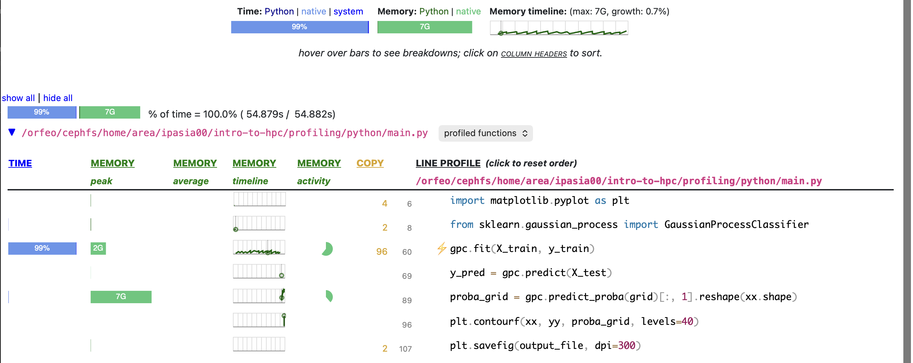

# Sampling Profiling


In sampling profiling, an external tool, called ***profiler***, is used to periodically capture the state of the program and then analyze the results to understand where the program is spending most of its time.

***Advantages***:

- Non-intrusive, as it does not require modifying the code. This can save time and reduce the risk of introducing bugs or changing the behavior of the program.
- More easy to apply to large codebases

***Disadvantages***:

- May not provide the same level of detail as instrumentation profiling (e.g. timing different blocks of the same function)
- It is based on statistical sampling, which means that even if the results can give a good indication of where the program is spending most of its time, they may not be as accurate as instrumentation profiling, especially if the sampling rate is too low.
- Profilers can introdudce overhead, which can affect the performance of the program and lead to inaccurate results
- Very language and platform dependent: many profilers are designed for specific programming languages or platforms. 


## Example 1: Profiling a C code

??? abstract "The code"
    In this section the following toy `C` code will be used:

    ```c
    #include <stdio.h>
    #include <stdlib.h>
    #include <math.h>

    // 200M * 8byte ~ 1.6GB
    #define N_ALLOC 200000000

    #ifndef N_CCOMP
    #define N_CCOMP 2000000000
    #endif

    void function_a(size_t n) {
        double *a = calloc(n, sizeof(double));
        free(a);
    }

    double function_b(size_t n) {
        double x = 0.0;
        for (size_t i = 1; i < n; i++)
            x += sin(i) * cos(i) * sqrt(i);
        return x;
    }

    void function_c() {
        size_t n_iter = (size_t)N_CCOMP*0.15;
        double *a = calloc(100, sizeof(double));
        double x = 0.0;
        for (size_t i = 0; i < n_iter; i++)
            x += sin(i) * cos(i) * sqrt(i);
        // Create a memory leak
        // free(a)
    }


    int main() {
        function_a(N_ALLOC);
        double r = function_b(N_CCOMP);
        function_c();
        return 0;
    }
    ```

    Which can be compiled with:

    ```bash
    gcc -lm -o demo demo.c 
    ```
    Where `-lm` is needed to link the math library, which is used in the code.

### 1.1 `gprof` profiler: find the bottleneck

`gprog` is the GNU profiler, which is a sampling profiler for C and C++ programs. Like many other profilers for compiled languaces, it requires to compile the code with a specific flag (`-pg`) to enable the profiling.

```bash
gcc -pg -lm -o demo demo.c
```

In this way, whem the program is executed, a file `gmon.out` will be generated, which contains the profiling data. This file can be analyzed with the `gprof` command to get a report of the time spent in each function:

```bash
./demo  # Run the program to generate the gmon.out file
# gprof <executable> <path_to_gmon_out>
gprof ./demo gmon.out | less
```

??? abstract "Example of gprof output"

    ```

    Flat profile:

    Each sample counts as 0.01 seconds.
    %   cumulative   self              self     total
    time   seconds   seconds    calls   s/call   s/call  name
    88.22      7.64     7.64        1     7.64     7.64  function_b
    11.32      8.62     0.98        1     0.98     0.98  function_c
    0.46      8.66     0.04                             _init
    0.00      8.66     0.00        1     0.00     0.00  function_a

    %         the percentage of the total running time of the
    time       program used by this function.

    cumulative a running sum of the number of seconds accounted
    seconds   for by this function and those listed above it.

    self      the number of seconds accounted for by this
    seconds    function alone.  This is the major sort for this
            listing.

    calls      the number of times this function was invoked, if
            this function is profiled, else blank.

    self      the average number of milliseconds spent in this
    ms/call    function per call, if this function is profiled,
        else blank.

    total     the average number of milliseconds spent in this
    ms/call    function and its descendents per call, if this
        function is profiled, else blank.

    name       the name of the function.  This is the minor sort
            for this listing. The index shows the location of
        the function in the gprof listing. If the index is
        in parenthesis it shows where it would appear in
        the gprof listing if it were to be printed.


    Copyright (C) 2012-2024 Free Software Foundation, Inc.

    Copying and distribution of this file, with or without modification,
    are permitted in any medium without royalty provided the copyright
    notice and this notice are preserved.


                Call graph (explanation follows)


    granularity: each sample hit covers 4 byte(s) for 0.12% of 8.66 seconds

    index % time    self  children    called     name
                                                    <spontaneous>
    [1]     99.5    0.00    8.62                 main [1]
                    7.64    0.00       1/1           function_b [2]
                    0.98    0.00       1/1           function_c [3]
                    0.00    0.00       1/1           function_a [5]
    -----------------------------------------------
                    7.64    0.00       1/1           main [1]
    [2]     88.2    7.64    0.00       1         function_b [2]
    -----------------------------------------------
                    0.98    0.00       1/1           main [1]
    [3]     11.3    0.98    0.00       1         function_c [3]
    -----------------------------------------------
                                                    <spontaneous>
    [4]      0.5    0.04    0.00                 _init [4]
    -----------------------------------------------
                    0.00    0.00       1/1           main [1]
    [5]      0.0    0.00    0.00       1         function_a [5]
    -----------------------------------------------

    This table describes the call tree of the program, and was sorted by
    the total amount of time spent in each function and its children.

    Each entry in this table consists of several lines.  The line with the
    index number at the left hand margin lists the current function.
    The lines above it list the functions that called this function,
    and the lines below it list the functions this one called.
    This line lists:
        index	A unique number given to each element of the table.
            Index numbers are sorted numerically.
            The index number is printed next to every function name so
            it is easier to look up where the function is in the table.

        % time	This is the percentage of the `total' time that was spent
            in this function and its children.  Note that due to
            different viewpoints, functions excluded by options, etc,
            these numbers will NOT add up to 100%.

        self	This is the total amount of time spent in this function.

        children	This is the total amount of time propagated into this
            function by its children.

        called	This is the number of times the function was called.
            If the function called itself recursively, the number
            only includes non-recursive calls, and is followed by
            a `+' and the number of recursive calls.

        name	The name of the current function.  The index number is
            printed after it.  If the function is a member of a
            cycle, the cycle number is printed between the
            function's name and the index number.


    For the function's parents, the fields have the following meanings:

        self	This is the amount of time that was propagated directly
            from the function into this parent.

        children	This is the amount of time that was propagated from
            the function's children into this parent.

        called	This is the number of times this parent called the
            function `/' the total number of times the function
            was called.  Recursive calls to the function are not
            included in the number after the `/'.

        name	This is the name of the parent.  The parent's index
            number is printed after it.  If the parent is a
            member of a cycle, the cycle number is printed between
            the name and the index number.

    If the parents of the function cannot be determined, the word
    `<spontaneous>' is printed in the `name' field, and all the other
    fields are blank.

    For the function's children, the fields have the following meanings:

        self	This is the amount of time that was propagated directly
            from the child into the function.

        children	This is the amount of time that was propagated from the
            child's children to the function.

        called	This is the number of times the function called
            this child `/' the total number of times the child
            was called.  Recursive calls by the child are not
            listed in the number after the `/'.

        name	This is the name of the child.  The child's index
            number is printed after it.  If the child is a
            member of a cycle, the cycle number is printed
            between the name and the index number.

    If there are any cycles (circles) in the call graph, there is an
    entry for the cycle-as-a-whole.  This entry shows who called the
    cycle (as parents) and the members of the cycle (as children.)
    The `+' recursive calls entry shows the number of function calls that
    were internal to the cycle, and the calls entry for each member shows,
    for that member, how many times it was called from other members of
    the cycle.


    Copyright (C) 2012-2024 Free Software Foundation, Inc.

    Copying and distribution of this file, with or without modification,
    are permitted in any medium without royalty provided the copyright
    notice and this notice are preserved.


    Index by function name

    [4] _init                   [2] function_b
    [5] function_a              [3] function_c
    ```

The fist thing to have a look is the `Flat profile` section, which shows the time spent in each function, ordered decresingly from the most time consuming to the least. 

In our case we got:

```
Each sample counts as 0.01 seconds.
%   cumulative   self              self     total
time   seconds   seconds    calls   s/call   s/call  name
88.22      7.64     7.64        1     7.64     7.64  function_b
11.32      8.62     0.98        1     0.98     0.98  function_c
0.46      8.66     0.04                             _init
0.00      8.66     0.00        1     0.00     0.00  function_a
```

From this section we can immediately see that the most time consuming function is `function_b`, which takes about 88% of the total time (7.64 seconds out of 8.66 seconds) and that `function_c` takes about 11% of the total time (0.98 seconds out of 8.66 seconds).
The `_init` function is a special function that is called before the `main`  and is not part of our code, it represents the time spent in the initialization of the program and as we can notice is completely negligible. The `function_a` is the least time consuming function, taking less than 0.01% of the total time, and it is expected since it just allocates and frees a large array, which is a very fast operation.

Then we can have a look at the `Call graph` section, which shows the call tree of the program, and was sorted by the total amount of time spent in each function and its children. 

```
index % time    self  children    called     name
                                                <spontaneous>
[1]     99.5    0.00    8.62                 main [1]
                7.64    0.00       1/1           function_b [2]
                0.98    0.00       1/1           function_c [3]
                0.00    0.00       1/1           function_a [5]
-----------------------------------------------
                7.64    0.00       1/1           main [1]
[2]     88.2    7.64    0.00       1         function_b [2]
-----------------------------------------------
                0.98    0.00       1/1           main [1]
[3]     11.3    0.98    0.00       1         function_c [3]
-----------------------------------------------
                                                <spontaneous>
[4]      0.5    0.04    0.00                 _init [4]
-----------------------------------------------
                0.00    0.00       1/1           main [1]
[5]      0.0    0.00    0.00       1         function_a [5]
-----------------------------------------------
```

From this section we can see in the first row that the 99.45% of the total time is spent in the `main` function, which is expected since it is the entry point of the program and it calls all the other functions.

Then we can see that `function_b` is called by `main` and takes 88.2% of the total time, while `function_c` is also called by `main` and takes 11.3% of the total time (second and third row).
 
 The `_init` function is called spontaneously and takes 0.5% of the total time, while `function_a` is called by `main` and takes 0% of the total time (fourth and fifth row).

### 1.2 `Valgrind` profiler: describe the memory usage

Valgrind is a *memory profiler* for C and C++ programs, which can be used to describe the memory usage of the program and to detect memory leaks.

Similary to `gprof`, it requires to compile the code with a specific flag (`-g`) to enable the debugging symbols, which are needed by Valgrind to provide a detailed report of the memory usage.

```bash
gcc -g -lm -o -DN_CCOMP=20000000 demo demo.c
```

Where we decreased the value of `N_CCOMP` to reduce the running time of the program, since Valgrind can be very slow (it can multiply the running time of the program by 10 or more) and in this phase we are only interested in the memory usage of the program.

Again, we have to generate a report of the program behaviour, which can be done with the following command:

```bash
valgrind --tool=massif \
  --time-unit=ms \
  --max-snapshots=200 \
  --detailed-freq=1 \
  --massif-out-file=massif.demo.out \
  ./demo
```

Where: 

- `--tool=massif` specifies that we want to use the `massif` tool, which is a heap profiler that measures the memory usage of the program over time.
- `--max-snapshots=200` limits the number of snapshots to 200, the more snapshots we have, the more detailed is the report, but also the more time it takes to generate it and to analyze it.
- `--detailed-freq=1` every snapshot will be generated with a detailed report of the memory usage when that snapshot was taken.
- `--massif-out-file=massif.demo.out` specifies the name of the output file, which will contain the report of the memory usage.
- `./demo` is the executable to be profiled.

This command will generate a file `massif.demo.out`, which can be analyzed with the `ms_print` command to get a report of the memory usage:

```bash
ms_print massif.demo.out | less
```

??? abstract "Example of ms_print output"

    ```    --------------------------------------------------------------------------------
    Command:            ./demo_dbg_small
    Massif arguments:   --time-unit=ms --max-snapshots=200 --detailed-freq=1 --massif-out-file=massif.demo.out
    ms_print arguments: massif.demo.out
    --------------------------------------------------------------------------------


        GB
    1.490^      #
        |      #
        |      #
        |      #
        |      #
        |      #
        |      #
        |      #
        |      #
        |      #
        |      #
        |      #
        |      #
        |      #
        |      #
        |      #                                                                @
        |      #                                                                @
        |      #                                                                @
        |      #                                                                @
        |      #                                                                @
    0 +----------------------------------------------------------------------->s
        0                                                                   8.346

    Number of snapshots: 5
    Detailed snapshots: [0, 1, 2 (peak), 3, 4]

    --------------------------------------------------------------------------------
    n       time(ms)         total(B)   useful-heap(B) extra-heap(B)    stacks(B)
    --------------------------------------------------------------------------------
    0              0                0                0             0            0
    00.00% (0B) (heap allocation functions) malloc/new/new[], --alloc-fns, etc.

    --------------------------------------------------------------------------------
    n       time(ms)         total(B)   useful-heap(B) extra-heap(B)    stacks(B)
    --------------------------------------------------------------------------------
    1            725    1,600,004,040    1,600,000,000         4,040            0
    100.00% (1,600,000,000B) (heap allocation functions) malloc/new/new[], --alloc-fns, etc.
    ->100.00% (1,600,000,000B) 0x401182: function_a (demo.c:14)
    ->100.00% (1,600,000,000B) 0x401407: main (demo.c:38)

    --------------------------------------------------------------------------------
    n       time(ms)         total(B)   useful-heap(B) extra-heap(B)    stacks(B)
    --------------------------------------------------------------------------------
    2            725    1,600,004,040    1,600,000,000         4,040            0
    100.00% (1,600,000,000B) (heap allocation functions) malloc/new/new[], --alloc-fns, etc.
    ->100.00% (1,600,000,000B) 0x401182: function_a (demo.c:14)
    ->100.00% (1,600,000,000B) 0x401407: main (demo.c:38)

    --------------------------------------------------------------------------------
    n       time(ms)         total(B)   useful-heap(B) extra-heap(B)    stacks(B)
    --------------------------------------------------------------------------------
    3            725                0                0             0            0
    00.00% (0B) (heap allocation functions) malloc/new/new[], --alloc-fns, etc.
    ->00.00% (0B) in 1+ places, all below ms_print's threshold (01.00%)

    --------------------------------------------------------------------------------
    n       time(ms)         total(B)   useful-heap(B) extra-heap(B)    stacks(B)
    --------------------------------------------------------------------------------
    4          8,346      400,003,016      400,000,000         3,016            0
    100.00% (400,000,000B) (heap allocation functions) malloc/new/new[], --alloc-fns, etc.
    ->100.00% (400,000,000B) 0x4012DF: function_c (demo.c:28)
    | ->100.00% (400,000,000B) 0x401424: main (demo.c:40)
    |
    ->00.00% (0B) in 1+ places, all below ms_print's threshold (01.00%)

    ```

The first thing printed is a graph of the memory usage (y-axis) over time (x-axis), which can be useful to understand how the memory usage of the program evolves over time and to identify the peak memory usage.

Then we have a table with the detailed snapshots, which shows the memory usage at different points in time.

We can see that during the second and third snapshot, the function `function_a`, called by the function `main`, allocates 1,600,004,040 bytes (~1.6GB) of memory, which has to be freed at some point since in the fourth snapshot the memory usage is back to 0 bytes. 
Then at the end of the programm, in the last snapshot, the function `function_c`, called by the function `main`, allocates 400,003,016 bytes (~400MB) of memory.

With this output we can not be sure if the memory allocated in the the last part of the program is freed or not, since it was the very last snapshot. 
However, vallgrind also provides a tool called `memcheck`, which can be used to detect memory leaks, which can be used to check if the memory allocated in the last part of the program is freed or not.

```bash
valgrind --tool=memcheck \
  --leak-check=full \
  --show-leak-kinds=all \
  --track-origins=yes \
  --log-file=memcheck.demo.out \
  ./demo
```

Where:

- `--tool=memcheck` specifies that we want to use the `memcheck` tool, which is a memory checker that detects memory leaks and other memory-related errors.
- `--leak-check=full` enables the full leak check, which checks for all types of memory leaks (e.g., definitely lost, indirectly lost, possibly lost, etc.).
- `--show-leak-kinds=all` shows all the different types of memory leaks in the output.
- `--track-origins=yes` tracks the origin of uninitialized values, which can be useful to understand where the memory leak is coming from.
- `--log-file=memcheck.demo.out` specifies the name of the output file, which will contain the report of the memory leaks.
- `./demo` is the executable to be profiled.

This command will generate a file `memcheck.demo.out`, which can be analyzed to get a report of the memory leaks:

```bash
cat memcheck.demo.out
```

??? abstract "Example of memcheck output"

    ```
    ==2404121== Memcheck, a memory error detector
    ==2404121== Copyright (C) 2002-2024, and GNU GPL'd, by Julian Seward et al.
    ==2404121== Using Valgrind-3.24.0 and LibVEX; rerun with -h for copyright info
    ==2404121== Command: ./demo_dbg_small
    ==2404121== Parent PID: 1652668
    ==2404121==
    ==2404121== Warning: set address range perms: large range [0x59cbe040, 0xb929f040) (defined)
    ==2404121== Warning: set address range perms: large range [0x59cbe028, 0xb929f058) (noaccess)
    ==2404121== Warning: set address range perms: large range [0x4b48040, 0x1c8c0440) (defined)
    ==2404121==
    ==2404121== HEAP SUMMARY:
    ==2404121==     in use at exit: 400,000,000 bytes in 1 blocks
    ==2404121==   total heap usage: 2 allocs, 1 frees, 2,000,000,000 bytes allocated
    ==2404121==
    ==2404121== 400,000,000 bytes in 1 blocks are possibly lost in loss record 1 of 1
    ==2404121==    at 0x4849133: calloc (vg_replace_malloc.c:1675)
    ==2404121==    by 0x4012DF: function_c (demo.c:28)
    ==2404121==    by 0x401424: main (demo.c:40)
    ==2404121==
    ==2404121== LEAK SUMMARY:
    ==2404121==    definitely lost: 0 bytes in 0 blocks
    ==2404121==    indirectly lost: 0 bytes in 0 blocks
    ==2404121==      possibly lost: 400,000,000 bytes in 1 blocks
    ==2404121==    still reachable: 0 bytes in 0 blocks
    ==2404121==         suppressed: 0 bytes in 0 blocks
    ==2404121==
    ==2404121== For lists of detected and suppressed errors, rerun with: -s
    ==2404121== ERROR SUMMARY: 1 errors from 1 contexts (suppressed: 0 from 0)
    ```

From this output we can see that there is a memory leak in the program, since there are 400,000,000 bytes in 1 block that are possibly lost. 


## Example 2: Profiling a Python code

??? abstract "The code"
    In this section the following toy `main.py` code will be used:

    ```python
    #!/usr/bin/env python3
    # -*- coding: utf-8 -*-

    import numpy as np
    import matplotlib.pyplot as plt
    import time
    from sklearn.gaussian_process import GaussianProcessClassifier
    from sklearn.gaussian_process.kernels import (
        RBF,
        ConstantKernel as C,
        WhiteKernel,
        Matern
    )
    from sklearn.model_selection import train_test_split
    from sklearn.metrics import accuracy_score

    # ---------- Function definitions -----------
    def fit_and_test_gpc(X_train, y_train, X_test, y_test, kernel):
        gpc = GaussianProcessClassifier(
            kernel=kernel,
            n_restarts_optimizer=3,
            max_iter_predict=200,
            random_state=0
        )

        start_train = time.time()
        gpc.fit(X_train, y_train)
        end_train = time.time()

        print("Training time: %.3f sec" % (end_train - start_train))
        print("Learned kernel :\n", gpc.kernel_)

        start_pred = time.time()
        y_pred = gpc.predict(X_test)
        end_pred = time.time()

        print("Inference time: %.3f sec" % (end_pred - start_pred))
        print("Accuracy:", accuracy_score(y_test, y_pred))

        return gpc

    def predict_on_grid_and_plot(gpc, X, X_train, y_train, output_file="gp_classifier.png"):
        print("starting inference on a dense grid for plotting...")

        x_min, x_max = X[:, 0].min() - 1.0, X[:, 0].max() + 1.0
        y_min, y_max = X[:, 1].min() - 1.0, X[:, 1].max() + 1.0

        xx, yy = np.meshgrid(
            np.linspace(x_min, x_max, 350),
            np.linspace(y_min, y_max, 350)
        )
        grid = np.c_[xx.ravel(), yy.ravel()]

        start_grid = time.time()
        proba_grid = gpc.predict_proba(grid)[:, 1].reshape(xx.shape)
        end_grid = time.time()

        print("Prediction time for the grid: %.3f sec" % (end_grid - start_grid))

        plt.figure(figsize=(8, 6))
        plt.contourf(xx, yy, proba_grid, levels=40)
        plt.colorbar(label="P(y=1)")
        plt.contour(xx, yy, proba_grid, levels=[0.5], linewidths=2)

        plt.scatter(X_train[:, 0], X_train[:, 1],
                    c=y_train, s=10, alpha=0.6)

        plt.title("Gaussian Process Classifier (line_profiler)")
        plt.tight_layout()
        plt.savefig(output_file, dpi=300)
        plt.close()

        print("Plot saved at:", output_file)


    def main():
        # ------------------ Dataset generations ----------------------
        n_per_class = 600

        mu0 = np.array([-1.0, -0.5])
        mu1 = np.array([+1.0, +0.5])
        cov = np.array([[0.6, 0.2], [0.2, 0.6]])

        rng = np.random.default_rng(0)
        X0 = rng.multivariate_normal(mu0, cov, size=n_per_class)
        X1 = rng.multivariate_normal(mu1, cov, size=n_per_class)

        X = np.vstack([X0, X1])
        y = np.hstack([
            np.zeros(n_per_class, dtype=int),
            np.ones(n_per_class, dtype=int)
        ])

        # Split in train/test
        X_train, X_test, y_train, y_test = train_test_split(
            X, y, test_size=0.3, random_state=0, stratify=y
        )

        # ----------------- Kernel definition ----------------------
        kernel = (
            C(1.0, (1e-2, 1e3))
            * (RBF(length_scale=1.0) + Matern(length_scale=1.0, nu=1.5))
            + WhiteKernel(noise_level=1e-2)
        )

        gpc = fit_and_test_gpc(X_train, y_train, X_test, y_test, kernel)
        predict_on_grid_and_plot(gpc, X, X_train, y_train, output_file="gp_classifier.png")


    if __name__ == "__main__":
        main()
    ```

### 2.1 `scalene` profiler

Scalene is a CPU, memory and GPU profiler for Python programs, which can be used to describe the performance of the program and to identify the bottlenecks.
You can install it with pip:

```bash
python3 -m pip install scalene
```

Then you can run the profiler with the following command:

```bash
scalene run main.py
```

It will generate a report in the terminal, which can be analyzed to get a detailed report of the performance of the program, including the time spent in each function, the memory usage, and the GPU usage (if applicable).

You can both run the profiler in the teriminal with

```
scalene view --cli
```

Or retrive with `scp` the generated json format and open it with the `scalene view` command, which will open a web page with a detailed report of the performance of the program.

For example, we have obtained the following report:



From where we can se how the most time consuming part of the program is the fitting of the model, while in the inference (which is lower in time) the programs needed to allocate a huge amount of memory, which is expected since the inference of a Gaussian Process scales quadratically also in memory and we used a very dense grid.


### 2.2 `line_profiler` profiler

Another extremely popular profiler for Python is `line_profiler`, which can be used to describe the performance of the program at a line level, which can be useful to identify the bottlenecks in the code.

It can be installed with pip:

```bash
python3 -m pip install line_profiler
```

Differently from `scalene`, it requires to add a decorator `@profile` to the functions that we want to profile, for example:

```python
@profile
def main():
    # ...
```

Then we can run the profiler with the following command:

```bash
kernprof -l main.py
```

And inspect the results with:

```bash
python3 -m line_profiler main.py.lprof
```

!!! tip "Tip"

    Adding the `@profile` decorator may cause the program to be unrunnable if the code is not runned with `kernprof`, since the `profile` decorator is not defined. To avoid this issue, you can add a dummy definition of the `profile` decorator at the beginning of the code, for example:

    ```python
    try:
        profile          # type: ignore[name-defined]
    except NameError:
        def profile(func):  # type: ignore[no-redef]
            return func
    ```
    
??? abstract "Example of line_profiler output"

    ```
        Timer unit: 1e-06 s

    Total time: 48.1198 s
    File: main.py
    Function: fit_and_test_gpc at line 27

    Line #      Hits         Time  Per Hit   % Time  Line Contents
    ==============================================================
        27                                           @profile
        28                                           def fit_and_test_gpc(X_train, y_train, X_test, y_test, kernel):
        29         2          7.0      3.5      0.0      gpc = GaussianProcessClassifier(
        30         1          0.2      0.2      0.0          kernel=kernel,
        31         1          0.2      0.2      0.0          n_restarts_optimizer=3,
        32         1          0.2      0.2      0.0          max_iter_predict=200,
        33         1          0.2      0.2      0.0          random_state=0
        34                                               )
        35
        36         1          1.1      1.1      0.0      start_train = time.time()
        37         1   48104196.2 4.81e+07    100.0      gpc.fit(X_train, y_train)
        38         1         20.6     20.6      0.0      end_train = time.time()
        39
        40         1        127.6    127.6      0.0      print("Training time: %.3f sec" % (end_train - start_train))
        41         1        163.2    163.2      0.0      print("Learned kernel :\n", gpc.kernel_)
        42
        43         1          0.8      0.8      0.0      start_pred = time.time()
        44         1      12519.3  12519.3      0.0      y_pred = gpc.predict(X_test)
        45         1          1.4      1.4      0.0      end_pred = time.time()
        46
        47         1         94.0     94.0      0.0      print("Inference time: %.3f sec" % (end_pred - start_pred))
        48         1       2653.1   2653.1      0.0      print("Accuracy:", accuracy_score(y_test, y_pred))
        49
        50         1          0.4      0.4      0.0      return gpc

    Total time: 2.7595 s
    File: main.py
    Function: predict_on_grid_and_plot at line 53

    Line #      Hits         Time  Per Hit   % Time  Line Contents
    ==============================================================
        53                                           @profile
        54                                           def predict_on_grid_and_plot(gpc, X, X_train, y_train, output_file="gp_classifier.png"):
        55         1         34.7     34.7      0.0      print("starting inference on a dense grid for plotting...")
        56
        57         1         50.0     50.0      0.0      x_min, x_max = X[:, 0].min() - 1.0, X[:, 0].max() + 1.0
        58         1          5.4      5.4      0.0      y_min, y_max = X[:, 1].min() - 1.0, X[:, 1].max() + 1.0
        59
        60         2        168.1     84.1      0.0      xx, yy = np.meshgrid(
        61         1         72.2     72.2      0.0          np.linspace(x_min, x_max, 350),
        62         1         15.5     15.5      0.0          np.linspace(y_min, y_max, 350)
        63                                               )
        64         1        193.5    193.5      0.0      grid = np.c_[xx.ravel(), yy.ravel()]
        65
        66         1          1.0      1.0      0.0      start_grid = time.time()
        67         1    2235302.2 2.24e+06     81.0      proba_grid = gpc.predict_proba(grid)[:, 1].reshape(xx.shape)
        68         1         17.3     17.3      0.0      end_grid = time.time()
        69
        70         1         61.6     61.6      0.0      print("Prediction time for the grid: %.3f sec" % (end_grid - start_grid))
        71
        72         1      10562.8  10562.8      0.4      plt.figure(figsize=(8, 6))
        73         1      61579.0  61579.0      2.2      plt.contourf(xx, yy, proba_grid, levels=40)
        74         1      20610.0  20610.0      0.7      plt.colorbar(label="P(y=1)")
        75         1       6003.8   6003.8      0.2      plt.contour(xx, yy, proba_grid, levels=[0.5], linewidths=2)
        76
        77         2       4091.6   2045.8      0.1      plt.scatter(X_train[:, 0], X_train[:, 1],
        78         1          0.7      0.7      0.0                  c=y_train, s=10, alpha=0.6)
        79
        80         1        339.0    339.0      0.0      plt.title("Gaussian Process Classifier (line_profiler)")
        81         1     107743.5 107743.5      3.9      plt.tight_layout()
        82         1     312531.8 312531.8     11.3      plt.savefig(output_file, dpi=300)
        83         1         98.8     98.8      0.0      plt.close()
        84
        85         1         19.6     19.6      0.0      print("Grafico salvato in:", output_file)

    Total time: 50.8824 s
    File: main.py
    Function: main at line 88

    Line #      Hits         Time  Per Hit   % Time  Line Contents
    ==============================================================
        88                                           @profile
        89                                           def main():
        90                                               # ------------------ Dataset generations ----------------------
        91         1          0.5      0.5      0.0      n_per_class = 600
        92
        93         1          3.5      3.5      0.0      mu0 = np.array([-1.0, -0.5])
        94         1          1.9      1.9      0.0      mu1 = np.array([+1.0, +0.5])
        95         1          2.1      2.1      0.0      cov = np.array([[0.6, 0.2], [0.2, 0.6]])
        96
        97         1         81.4     81.4      0.0      rng = np.random.default_rng(0)
        98         1        468.2    468.2      0.0      X0 = rng.multivariate_normal(mu0, cov, size=n_per_class)
        99         1        141.9    141.9      0.0      X1 = rng.multivariate_normal(mu1, cov, size=n_per_class)
        100
        101         1         32.2     32.2      0.0      X = np.vstack([X0, X1])
        102         2         20.0     10.0      0.0      y = np.hstack([
        103         1          1.4      1.4      0.0          np.zeros(n_per_class, dtype=int),
        104         1          9.3      9.3      0.0          np.ones(n_per_class, dtype=int)
        105                                               ])
        106
        107                                               # Split in train/test
        108         2       1994.6    997.3      0.0      X_train, X_test, y_train, y_test = train_test_split(
        109         1          0.3      0.3      0.0          X, y, test_size=0.3, random_state=0, stratify=y
        110                                               )
        111
        112                                               # ----------------- Kernel definition ----------------------
        113         1          0.2      0.2      0.0      kernel = (
        114         3         12.1      4.0      0.0          C(1.0, (1e-2, 1e3))
        115         1         15.5     15.5      0.0          * (RBF(length_scale=1.0) + Matern(length_scale=1.0, nu=1.5))
        116         1          4.5      4.5      0.0          + WhiteKernel(noise_level=1e-2)
        117                                               )
        118
        119         1   48119945.6 4.81e+07     94.6      gpc = fit_and_test_gpc(X_train, y_train, X_test, y_test, kernel)
        120         1    2759697.2 2.76e+06      5.4      predict_on_grid_and_plot(gpc, X, X_train, y_train, output_file="gp_classifier.png")
    ```

*How to interpret the output?* $\rightarrow$ The output of `line_profiler` is divided into sections, one for each function that was profiled. Each section shows the time spent in each line of the function, ordered by the line number.

For exapmle we can se how during the execution of the `main` function, the 94.6% of the total time is spent in the `fit_and_test_gpc` function, while the 5.4% of the total time is spent in the `predict_on_grid_and_plot` function (last row of the output). 

Then we can have a look at the `fit_and_test_gpc` function, where we can see that the 100% of the time is spent in the line 37, which is the line where we fit the model, while the inference (line 44) takes only a negligible amount of time (0.8% of the total time).

---
<br>
Authors: Isac Pasianotto, Stefano Cozzini